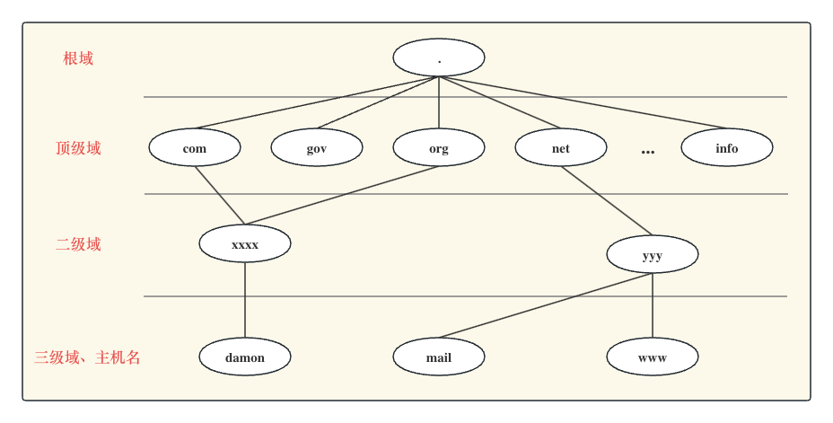
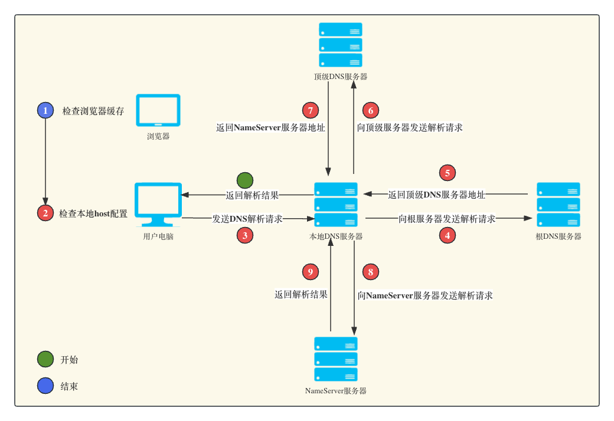

# DNS详解
## 1.概念
**DNS（Domain Name System）**即域名系统，可看做是一个**分布式数据库**，记录着[域名跟IP的映射关系]{color:red}，这样用户就不用去记忆IP，直接输入好记的域名，通过DNS转化便可以访问对应服务器上的资源，这个转化过程叫做**域名的解析**。

DNS运行在UDP协议之上，属于OSI七层模型中的应用层，使用的端口为53

## 2.域名空间

整个结构呈现一种倒立的树状，如下所示：

在上面的示例中，根节点（.）表示根域名，它是域名空间树的最顶层。根节点下面的每个节点都表示一个顶级域（.com、.org、.net等）。每个顶级域下面可以有多个子域名，形成更深层次的域名结构。

例如，"yyy.net"是"net"顶级域下的一个子域名，"www.yyy.net" 和 "mail.yyy.net" 是"yyy.com"下的子域名。这种层次化结构使得域名可以进行有效的命名和管理。

在实际的DNS解析过程中，域名空间树的结构用于指导查询和路由，使得DNS服务器能够根据域名的层次关系进行正确的解析和转发。客户端查询时，DNS服务器会根据域名空间树的结构，从顶层逐级向下进行查询，直到找到所需的解析结果或者到达叶子节点无法继续查询为止。

## 3.域名解析过程

DNS解析过程解析过程如下图：

以 www.google.com 为例子，对每个过程进行说明：
1. 用户在浏览器输入 www.google.com 。为防止用户每次访问请求都要重新解析域名，浏览器本身会对域名的解析结果进行一定时间的缓存（不同浏览器缓存策略不同，比如Chrome是由操作系统控制的），命中缓存后则直接返回缓存结果；
2. 如果浏览器缓存中没命中，则开始检查本地hosts。其实在此之前，**如果操作系统缓存了DNS域名的解析结果，会优先去本地缓存查询，没有才会使用本地hosts文件**。在Mac系统中，你可以通过/etc/hosts文件来配置域名和IP的映射关系。
3. 前两个过程若无法完成解析，就会使用到我们配置的DNS地址了，在我们的网络设置中可以找到，一般会配置多个DNS服务器地址。如果你是政府、学校等基础设施比较健全的环境一般会设有专门的DNS解析服务器，你的大部分解析会在此步完成。本地DNS服务器也是DNS解析过程中完成 [**递归查询**](#名词解释) 和 [**迭代查询**](#名词解释) 的角色。本地 DNS 服务器接收到查询请求后，首先会检查自己的缓存，看是否已经有 "www.google.com" 的解析结果。如果有并且仍然有效，则本地 DNS 服务器直接返回缓存中的解析结果给客户端，解析过程到此结束。
4. 上面的步骤依然没有查询到，则把请求发至**根DNS服务器**（本地DNS服务器未设置转发，如果设置转发则按转发走），该请求会包含要解析的域名"www.google.com" ；
5. **根DNS服务器**收到请求，它会解析请求中的顶级域名，即"com"，以此来判断由哪台具体的**顶级域名服务器（TLD NDS）**来处理。根服务器会返回给本地 DNS 服务器一个响应，其中包含了负责管理".com"顶级域名的 TLD DNS 服务器的 IP 地址
6. 本地 DNS 服务器收到根服务器的响应后，它会向返回的 **顶级DNS服务器** 服务器发送一个新的 DNS 查询请求
7. **顶级DNS服务器** 接收到本地 DNS 服务器的查询请求后，它会解析请求中的次级域名，即"google.com"，并据此选择相应的权威 DNS (NameServer DNS）。它会返回给本地 DNS 服务器一个响应，其中包含了管理"google.com"域名的权威 DNS 服务器的 IP 地址;
8. 本地 DNS 服务器收到顶级DNS服务器的响应后，它会向返回的 **NameServer DNS 服务器** 发送一个新的 DNS 查询请求，请求解析"www.google.com"；
9. NameServer DNS 服务器接收到本地 DNS 服务器的查询请求后，它会查询自身的域名记录，找到"www.google.com" 对应的 IP 地址成功解析，返回结果给本地DNS服务器；
10. 拿到DNS的解析结果，更新缓存，并将解析结果返回给客户端，到此解析结束。

## 名词解释
* 递归查询：本地 DNS 服务器代表客户端向其他级别的 DNS 服务器发送查询请求，并负责收集、整合和返回最终的解析结果。这种查询方式使得客户端无需直接与根 DNS 服务器、TLD DNS 服务器和权威 DNS 服务器进行交互；
* 迭代查询：每一级 DNS 服务器都只返回下一级服务器的 IP 地址，而不直接提供解析结果。客户端根据服务器返回的 IP 地址，逐级向下发送查询请求，直到最终获得解析结果或者查询失败。这种查询方式要求客户端主动承担查询的责任和流程控制。

