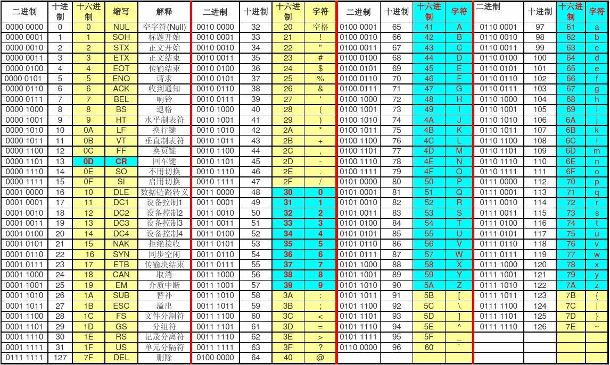
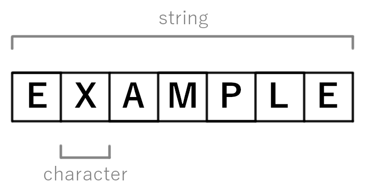

# 数据结构之“字符串”(二)

## 1.概念与组成

介绍**字符串**之前，我们先了解下**字符**的概念。

>   **字符** 是一种信息单位，大致对应于字母、类似字母的单位或符号。

**字符** 包括**字母**、**数字**、常用**标点符号**(如“。”或“-”)和**空格**，还包括一些 **控制字符(control characters)** 以及 **非打印字符(non-printing character)**。

一个字节通常使用8位(bits)(一字节,byte)来表示，这种用计算机语言来描述字符的方式，称之为字符编码系统。

计算机编码的发展历史可以追溯到二十世纪四五十年代。

最初的编码方案，例如**美国信息交换标准码**（ASCII），使用了7位二进制数字表示数字、字母和符号，因为**7**位足以表示**128**(每位可以是0或1，所以是2的7次方)种不同的字符。



随着计算机的广泛普及，人们开始使用计算机进行日常活动，例如撰写文件和电子邮件。由于ASCII不能满足其他语言和字符集的需求，出现了许多其他编码方案，例如**ISO-8859**和**GB2312**、**Big5**等，这些编码方案解决了ASCII无法表示其他语言和字符集的问题。但是，这些编码方案的局限性在于它们都是固定长度字符编码，这意味着它们不能轻松地处理美国以外的语言和字符，也不能轻松的处理不同语言的混用问题。

于是可变长度编码方案**UTF-8**应运而生，它使用**1到4个字节**表示每个字符，在保证兼容旧有的ASCII字符，可以对各种语言的文字进行编码，逐渐成为作为最常用的Unicode编码方案之一。

有了上面字符的了解，字符串就容易理解了，我们“**像穿羊肉串**”一样，把一个个的字符串起来，就得到了**字符串，像下面这样：**



最终，我们给出字符串定义：**字符串是由零个或多个字符组成的有限序列**。


## 2.实现

字符串作为一种数据结构，其实现方式也是多种多样，其中最常见的有以下两种：

1. **数组：**数组的每个元素表示字符串的一个字符。数组可以根据需要进行调整大小；

2. **链表：**每个节点包含一个字符和一个指向下一个节点的指针；

在不同的编程语言中，比如：C++、Perl和Ruby是允许字符串在创建以后被修改，这种叫做**可变字符串**；相反的，在诸如Java、Lua、Python和Go等编程语言中，字符串的值是固定的，如果要改变则需要创建一个新的字符串，这种称为**不可变字符串**。

这两种设计各有利弊，可变字符串更**节省空间**，比可变字符串虽然需要产生多份copy，但确保证了绝对的**线程安全**。

如何标识一个字符串的结束，基本上有以下几种：

1.   **Null-terminated**：使用一个 null(所有位都是0) 字符，标识字符串结束，因此一个长度为 N 的字符串，至少需要 N + 1 的空间来存储，C语言便采用了这种方式；
2.   **Byte- and bit-terminated：**使用一个字符或者是一位标识结束，比如```$```又或者是```:```
3.   **Length-prefixed**: 使用一个字节来存储长度，根据长度信息便可获取正确的字符串

比较上面三种方式，共同点是都需要额外的空间去存储判断结束需要的信息；

不同点，其中 **1** 和 **2** 其实可以算是一种方案，其本质都是选取一种特别的标识符，这么做的缺点就是字符串中是不允许出现这种标识结束的标识符的。第 **3** 种方式避免了上面的问题，但受限于长度字节可表示数字的大小，同时也限制了字符串的长度。不过可以通过给长度信息分配更多的字节来解决。


## 3.函数

字符串提供一些**函数**，经常用来**创建**一个字符串，或者**修改**一个可变字符串的内容，当然还包括对字符串信息的**查询**。基于不同的编程语言，函数的名字有所不同。以下列举一些常见的字符串函数（以下示例，均使用Python）：

-   **Length**：它负责返回一个字符串的长度（不包括结束符和其他结构信息），此函数常备命名为```length``` or ```len```.比如在Python中，```len('hello world')```会返回结果```11```

-   **CharAt**：```charAt(string, index)```返回字符串中下标为index的字符，比如：```"Hello, World"[2]```将返回```l```；

-   **Compare**: ```compare(string1,string2)```返回 **Boolean**；

-   **Concatenation**：```concatenate(string1,string2)``` 两个字符串拼接，返回拼接后的字符串；

-   **Contains：**contains(string,substring) 判断一个字符串中是否包含子串，返回**Boolean**；

-   **Find**：```find(*string*,substring)```寻找子串在字符串中的位置并返回**下标**(index)，如果没找到则返回 **-1**

-   **Format**：```format(formatstring, items)```根据formatstring格式化输出item，比如在Python3.6中：

    ```
    "My {0} costs ${1:.2f}".format("pen", 19.99); # returns "My pen costs $19.99"
    ```

类似的函数还有许多，比如：**index**、**indexof**、**join**、**left**、**replace**、**reverse**、**split**、**substring**等，在正式使用到的时候，可以查看对应的编程语言提供的文档。


## 4.操作

**题目：最长回文子串**

描述：给你一个字符串 `s`，找到 `s` 中最长的回文子串。

比如：

```
输入：s = "babad"
输出："bab"
解释："aba" 同样是符合题意的答案。
```


下面将使用Python3解决：

```python
class Solution:
    def longestPalindrome(self, s: str) -> str:
        s_length = len(s)
        start, end, max_length = 0, 0, 0
        if not s or s_length == 1:
            return s
        if s_length == 2:
            return s if s[0] == s[1] else s[0]
        for i in range(0, s_length):
            if len(s[i:]) <= math.floor(max_length / 2):
                break
            p, pp, n, nn, l, ll = 0, 0, 0, 0, 0, 0
            if i > 0:
                p, n, l = self.maxPalindrome(s, i - 1, i + 1)
            # 中心相邻相等需多计算一次
            if i + 1 < s_length and s[i] == s[i + 1]:
                pp, nn, ll = self.maxPalindrome(s, i, i + 1)
            if max(max_length, l, ll) != max_length:
                if l > ll:
                    start, end, max_length = p, n, l
                else:
                    start, end, max_length = pp, nn, ll
        return s[start:end + 1] if max_length > 0 else s[0]

    def maxPalindrome(self, s: str, pre: int, nex: int) -> (int, int, int):
        s_length = len(s)
        cursor = 0
        has_eq = False
        while pre - cursor >= 0 and nex + cursor < s_length:
            if s[pre - cursor] != s[nex + cursor]:
                break
            cursor += 1
            has_eq = True
        # 最终比配的是上一个
        if cursor > 0:
            cursor -= 1
        if has_eq:
            return pre - cursor, nex + cursor, 2 * cursor + nex - pre
        else:
            return 0, 0, 0
```

解释：以上代码使用到了 **中心扩散**  的思想，需要注意的是当处理相邻元素相等时需要多计算一次，以满足偶数串的情况。

